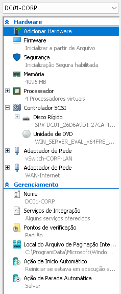
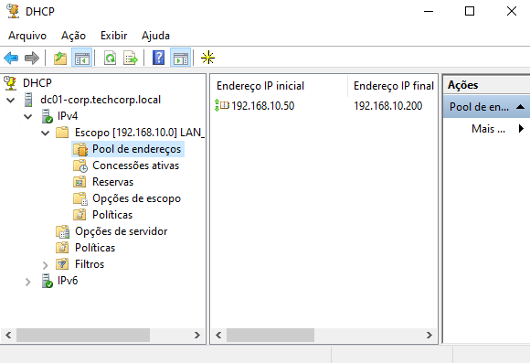
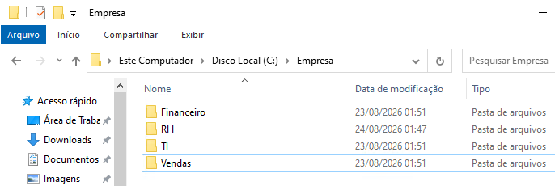

# 🖥️ Implementação de Infraestrutura On-Premise: Active Directory DS & Serviços Locais (Entra ID Ready)

Este projeto documenta o provisionamento do zero de uma infraestrutura corporativa _On-Premise_ baseada em Windows Server 2022. O foco principal deste laboratório foi aplicar padrões de arquitetura corporativa, gerenciamento de identidades pelo modelo **AGDLP**, serviços essenciais de rede (DNS/DHCP), gestão de arquivos e **preparação da infraestrutura para uma futura integração em Nuvem Híbrida com o Microsoft Entra ID**.

---
## 📋 Visão Geral do Ambiente (Topologia)

| **Ativo / VM**          | **Sistema Operacional**      | **Função / Hostname** | **Endereço IP / Sub-rede** |
| ----------------------- | ---------------------------- | --------------------- | -------------------------- |
| **Domain Controller**   | Windows Server 2022 Standard | `DC01-CORP`           | `192.168.10.10 /24`        |
| **Gateway Virtual**     | vSwitch Interno (Hyper-V)    | `vSwitch-CORP-LAN`    | `192.168.10.1 /24`         |
| **Escopo DHCP**         | Servidor DHCP do AD          | `LAN_Corporativa`     | `192.168.10.50` a `.200`   |
| **Domínio AD DS**       | Active Directory             | `techcorp.local`      | FQDN Interno               |
| **Sufixo UPN Roteável** | AD Domains and Trusts        | `techcorp.com.br`     | **Entra ID Ready**         |

## 📐 Diagrama de Arquitetura do Laboratório

```
+-------------------------------------------------------------------------------+
|                       REDE CORPORATIVA (192.168.10.0/24)                      |
|                                                                               |
|   +-----------------------------------------------------------------------+   |
|   |                         HYPER-V HOST (Windows 11)                     |   |
|   |                                                                       |   |
|   |   +---------------------------------------------------------------+   |   |
|   |   |                     VM: DC01-CORP                             |   |   |
|   |   |               (Windows Server 2022 Standard)                  |   |   |
|   |   |                                                               |   |   |
|   |   |   • AD DS (Domínio: techcorp.local)                           |   |   |
|   |   |   • Sufixo UPN Roteável: @techcorp.com.br                     |   |   |
|   |   |   • DNS Server + Zona de Pesquisa Inversa                     |   |   |
|   |   |   • DHCP Server Autorizado (Pool: 192.168.10.50 - .200)       |   |   |
|   |   |   • File Server SMB (C:\Empresa\TI, RH, Financeiro, Vendas)   |   |   |
|   |   |                                                               |   |   |
|   |   |   IP Estático: 192.168.10.10/24                               |   |   |
|   |   +---------------------------------------------------------------+   |   |
|   |                                   |                                   |   |
|   |                   vSwitch Interno: vSwitch-CORP-LAN                   |   |   |
|   +-----------------------------------------------------------------------+   |
+-------------------------------------------------------------------------------+
```
## 🚀 Etapas do Projetos & Decisões Técnicas

### Ações Executadas:

- Criação do comutador virtual de rede interna `vSwitch-CORP-LAN` no Hyper-V para isolamento do ambiente de simulação.
    
- Provisionamento da VM **Geração 2** (Suporte UEFI/Secure Boot) nomeada como `DC01-CORP` com 4 GB de RAM dinâmica, 2 vCPUs e disco virtual de 60 GB.
    
- Instalação do **Windows Server 2022 Standard (Experiência Desktop)**.
    
- Padronização do Hostname e fixação do IP Estático `192.168.10.10/24` apontando o DNS para si mesmo.
    
- Salvamento do Ponto de Verificação: `CKP-ETAPA1-BASE-SO-IPFIXO`.
    
#### 📸 Evidências Visuais:
<details>
<p align="center">
  <br>
  <i>Figura 1: Gerenciador de Comutador Virtual mostrando o `vSwitch-CORP-LAN` criado como rede Interna e as configurações da VM no Hyper-V mostrando a memória (4 GB) e  vCPUs (4).</i>
</p>
</details>

---
### Ações Executadas:

- Instalação automatizada das Roles _AD DS_, _DNS Server_ e ferramentas _RSAT_ via PowerShell.
    
- Promoção do servidor a Controlador de Domínio gerando uma nova floresta com o FQDN `techcorp.local` e NetBIOS `TECHCORP`.
    
- Configuração do nível funcional da floresta/domínio no padrão Windows Server 2016/2022.
    
- Criação e validação da **Zona de Pesquisa Inversa de DNS** para a sub-rede `10.168.192.in-addr.arpa`.
    
- Salvamento do Ponto de Verificação: `CKP-ETAPA2-ADDS-PROMOTED-DNS`.
    
#### 📸 Evidências Visuais:
<details>
<p align="center">
  <br>
  <i>Figura 1: Configuração da rede virtual no Hyper-V.</i>
</p>
</details>

---
### Ações Executadas:

- Habilitação dos Recursos Avançados (_Advanced Features_) no console `dsa.msc`.
    
- Criação da Unidade Organizacional Raiz `Empresa_CORP` isolando a empresa das pastas padrões do sistema.
    
- Criação da estrutura hierárquica dividida em `Usuarios`, `Computadores` e `Grupos`.
    
- Subdivisão departamental da OU Usuarios (`TI`, `RH`, `Financeiro`, `Diretoria`) e de dispositivos (`Workstations`, `Servers`).
    
- Aplicação da política de segurança de **Proteção contra Exclusão Acidental** em todas as OUs.
    
- Salvamento do Ponto de Verificação: `CKP-ETAPA3-OU-STRUCTURE-READY`.
    
#### 📸 Evidências Visuais:
<details>
<p align="center">
  <br>
  <i>Figura 1: Terminal do PowerShell executando o comando `Install-ADDSForest` e a mensagem de reinício do sistema.</i>
</p>
<p align="center">
  <br>
  <i>Figura 1: Tela de logon do Windows Server exibindo o domínio.</i>
</p>
<p align="center">
  <br>
  <i>Figura 1: console do Gerenciador DNS (`dnsmgmt.msc`) mostrando a Zona de Pesquisa Inversa `10.168.192.in-addr.arpa` criada.</i>
</p>
</details>

---
### Ações Executadas:

- Cadastramento do **Sufixo UPN alternativo e roteável** (`@techcorp.com.br`) no _AD Domains and Trusts_, preparando o ambiente para sincronização em nuvem (Entra ID).
    
- Aplicação da metodologia **AGDLP** para concessão de privilégios de segurança:
    
    - **Grupo Global (GG):** Criado o grupo `GRP_TI_ADM` para agrupar as contas dos usuários do setor de TI.
        
    - **Grupo Local de Domínio (DL):** Criado o grupo `DL_Pasta_TI_RW` focado em gerenciar o recurso.
        
    - **Aninhamento:** Adicionado o Grupo Global dentro do Grupo Local de Domínio.
        
- Provisionamento do usuário `Rodrigo Soares` na OU `TI` com o UPN roteável `rodrigo.soares@techcorp.com.br` e inclusão no grupo `GRP_TI_ADM`.
    
- Salvamento do Ponto de Verificação: `CKP-ETAPA4-IDENTITY-UPN-AGDLP-READY`.
    
#### 📸 Evidências Visuais:
<details>
<p align="center">
  <br>
  <i>Figura 1: Print da janela do `dsa.msc` com a árvore do domínio `techcorp.local` expandida até a sub-OU `TI`, mostrando toda a hierarquia construída.</i>
</p>
<p align="center">
  <br>
  <i>Figura 1: Print da janela do `dsa.msc` com a árvore do domínio `techcorp.local` expandida até a sub-OU `TI`, mostrando toda a hierarquia construída.</i>
</p>
<p align="center">
  <br>
  <i>Figura 1: Print das propriedades do usuário `Rodrigo Soares` no `dsa.msc` (aba _Conta / Account_) destacando o nome de logon com o sufixo `@techcorp.com.br`.</i>
</p>
<p align="center">
  <br>
  <i>Figura 1: Print das propriedades do grupo `DL_Pasta_TI_RW` (aba _Membros_) mostrando o grupo `GRP_TI_ADM` aninhado.</i>
</p>
</details>

---
### Ações Executadas:

- Instalação e autorização do serviço de **DHCP Server** no Active Directory.
    
- Criação do escopo `LAN_Corporativa` (`192.168.10.50` a `.200 /24`) com distribuição de Gateway (`192.168.10.1`) e DNS apontado para o `DC01`.
    
- Construção da estrutura de pastas de File Server no caminho `C:\Empresa` (`TI`, `RH`, `Financeiro`, `Vendas`).
    
- Configuração do compartilhamento SMB oculto de rede e **quebra de herança de permissões NTFS**.
    
- Aplicação do princípio do **Menor Privilégio (_Least Privilege_)**: a pasta da TI foi restrita unicamente ao grupo `DL_Pasta_TI_RW`, garantindo segregação total entre departamentos.
    
- Salvamento do Ponto de Verificação: `CKP-ETAPA5-DHCP-FILESERVER-AGDLP-READY`.
    
#### 📸 Evidências Visuais:
<details>
<p align="center">
  <br>
  <i>Figura 1: Print do console do DHCP (`dhcpmgmt.msc`) mostrando o escopo `LAN_Corporativa` ativo com o pool de IPs configurado.</i>
</p>
<p align="center">
  <br>
  <i>Figura 1: Configuração da rede virtual no Hyper-V.</i>
</p>
<p align="center">
  <br>
  <i>Figura 1: Print da aba de **Segurança Avançada** da pasta `TI` mostrando a herança desabilitada e apenas o grupo `DL_Pasta_TI_RW` com permissão de Modificação..</i>
</p>
</details>

---
# 🖥️ Ultima Etapa: Health Check & Validação "Entra ID Ready"

Este repositório documenta a etapa final de preparação da infraestrutura *On-Premise*. Antes de realizar a migração ou sincronização com o **Microsoft Entra ID (Azure AD)**, um Analista N2 precisa garantir a integridade dos serviços do Active Directory local e realizar a sanitização da base de identidades.

---
## 📋 Visão Geral da Etapa 6

| Atividade / Teste              | Ferramenta Utilizada | Finalidade / Objetivo                                             | Status de Validação                   |
| :----------------------------- | :------------------- | :---------------------------------------------------------------- | :------------------------------------ |
| **Diagnóstico do AD DS**       | `dcdiag.exe` (CLI)   | Testes de integridade em DNS, SYSVOL e Netlogon                   | `PASSED` (Aprovado)                   |
| **Sanitização de Identidades** | Microsoft IdFix Tool | Identificar conflitos de UPN, caracteres inválidos e duplicidades | `Clean / Ready`                       |
| **Checkpoint Final**           | Hyper-V Manager      | Ponto de restauração limpo e pronto para o ambiente Híbrido       | `CKP-ETAPA6-ADDS-HEALTHY-ENTRA-READY` |

---
## ⚙️ Procedimento de Execução

### 1. Diagnóstico do Active Directory DS (`dcdiag`)
Abertura do terminal PowerShell como Administrador no controlador de domínio `DC01-CORP` e execução dos testes essenciais de saúde do sistema:

```powershell
dcdiag /v /test:dns /test:sysvol /test:netlogon
```
- **Itens Auditados:**
    
    - **Test: DNS:** Validação de resolução de nomes, registros SRV e delegação interna.
        
    - **Test: SYSVOL:** Verificação do compartilhamento e integridade de pastas de sistema.
        
    - **Test: Netlogon:** Checagem da disponibilidade do serviço de autenticação do domínio.
        

### 2. Sanitização de Objetos para Nuvem (Microsoft IdFix)

Instalação e execução do **Microsoft IdFix** para varredura do diretório `techcorp.local`. A ferramenta analisa todos os usuários e grupos em busca de incompatibilidades com os critérios de sincronização do Entra Connect.

- **Ações de Correção:**
    
    - Confirmação do sufixo UPN roteável `@techcorp.com.br` para todas as contas ativas (ex: `rodrigo.soares@techcorp.com.br`).
        
    - Remoção de espaços em branco e caracteres especiais não suportados no atributo `sAMAccountName` e nomes de exibição.
        

#### 📸 Evidências Visuais:
<details>
<p align="center">
  <br>
  <i>Figura 1: Resultado do Diagnóstico dcdiag no Terminal.</i>
</p>
<p align="center">
  <br>
  <i>Figura 1: Varredura de Identidades com a Ferramenta Microsoft IdFix.</i>
</p>
</details>

## 🛠️ Relatório de Casos de Troubleshooting (Sanitização Pré-Nuvem)

- **Sintoma:** Ao rodar a varredura inicial no IdFix, a conta do usuário `Rodrigo Soares` foi sinalizada com o tipo de alerta _ERROR: Invalid UPN Domain_.
    
- **Causa Raiz:** O usuário havia sido cadastrado com o sufixo padrão de instalação `.local` (`rodrigo.soares@techcorp.local`), que não pode ser validado em locatários de nuvem.
    
- **Solução Aplicada:**
    
    1. Acesso ao console `dsa.msc` na OU `TI`.
        
    2. Ajuste na aba _Conta (Account)_ alterando o sufixo do nome de logon para `@techcorp.com.br`.
        
    3. Re-execução da consulta (`Query`) no IdFix, confirmando a resolução do conflito.
        
## 🎯 Estado Final do Laboratório On-Premise

Com a conclusão desta etapa, o ambiente local atinge a maturação necessária para operar em ambiente de produção e está tecnicamente aprovado (**Entra ID Ready**) para os seguintes cenários:

1. **Sincronização Híbrida:** Instalação e configuração do Microsoft Entra Connect.
    
2. **Federated Identity / SSO:** Integração de identidades para login único em aplicações SaaS.
    
3. **Migração para Azure:** Extensão do Domain Controller para uma máquina virtual no Microsoft Azure.
    
## ➡️ Próximos Passos (Continuação para Nuvem Híbrida)

A infraestrutura mantida neste repositório representa o estado final do ambiente _On-Premise_. O próximo repositório da trilha documenta a extensão das identidades locais para o ambiente de nuvem da Microsoft:

👉 **Próximo Laboratório:** [Lab-infra-cloud](https://www.google.com/search?q=https://github.com/seu-usuario/Lab-infra-cloud&authuser=1) _(Integração com Microsoft Entra ID via Entra Connect, Licenciamento e Gestão Híbrida)_.

