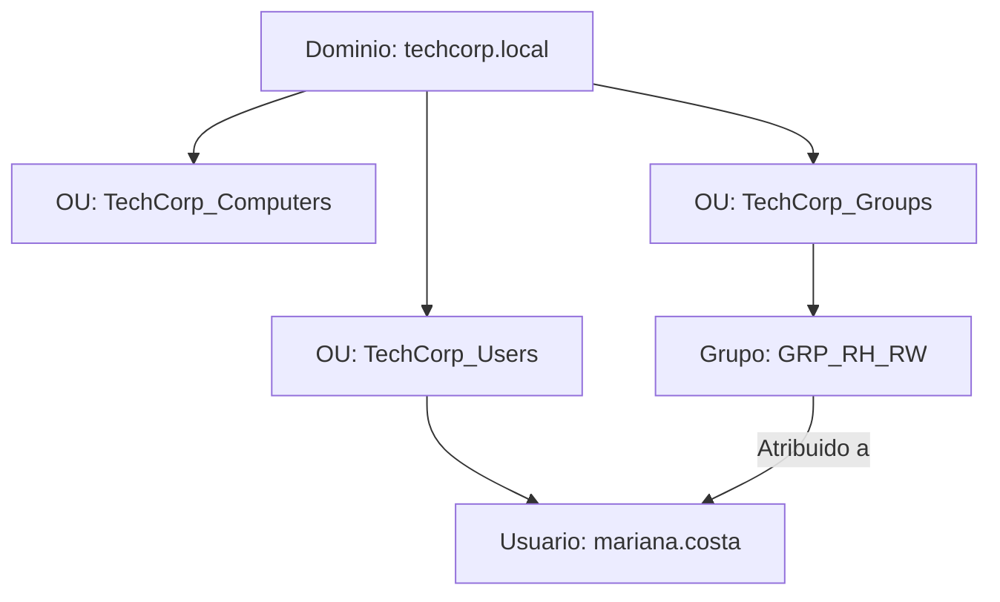

### 🚧 Status: Em desenvolvimento contínuo.

# Módulo 02: Implementação de Infraestrutura Active Directory (AD DS)
## 🏢 Problema do Negócio
A empresa não possuía uma gestão centralizada de usuários, computadores e políticas de segurança. Sem um domínio corporativo, a administração de credenciais e permissões era realizada individualmente em cada máquina, gerando brechas de segurança, falta de auditoria de acessos e alto impacto operacional na rotina do suporte N1.

## 🛠️ Solução Implementada
Promoção do servidor `SRV-DC01` a Controlador de Domínio (DC) da floresta `techcorp.local`. Foi estruturada uma hierarquia de Unidades Organizacionais (OUs) dividida por departamentos e criadas as contas de usuários e grupos de segurança seguindo o modelo RBAC (*Role-Based Access Control*).

---

## 💻 Informações do Servidor (DC)
* **Nome do Servidor:** `SRV-DC01`
* **Domínio FQDN:** `techcorp.local`
* **NetBIOS:** `TECHCORP`
* **Endereço IP Static:** `192.168.10.10/24`
* **DNS Primary:** `127.0.0.1`
* **Virtual Switch:** `LAB-TECHCORP` (Hyper-V)

## 📋 Pré-requisitos
* Servidor: Windows Server 2019/2022 com a função AD DS instalada.
* Permissões: Privilégios de Administrador Local (para promoção) ou Domain Admin (pós-promoção).
* Rede: Endereço IP estático configurado na interface do servidor.

---

## 🏗️ Estrutura de Unidades Organizacionais (OUs) e Grupos

### Unidade Organizacional Raiz: `TechCorp`

| Sub-OU | Função / Descrição | Grupos Associados |
| :--- | :--- | :--- |
| `OU_TI` | Equipe de Tecnologia e Administração | `GRP_TI_Admins` |
| `OU_Financeiro` | Setor Financeiro e Contabilidade | `GRP_Financeiro_RW` |
| `OU_RH` | Recursos Humanos e Pessoal | `GRP_RH_RW` |
| `OU_Vendas` | Equipe Comercial | `GRP_Vendas_RW` |
| `OU_Diretoria` | Gestão Executiva | - |
| `OU_Computadores` | Estações de trabalho ingressadas | - |
| `OU_Grupos` | Armazenamento de Grupos de Segurança | Todos os grupos |

## 📐 Diagrama da Estrutura de Domínio

## 🖼️ Evidências de Implantação

### 1. Promoção do Servidor a Controlador de Domínio

### 2. Estrutura de OUs e Objetos de Usuários

### 3. Ingresso do Cliente Windows 10 e Validação de GPO

---
---
---

## 🔒 Política de Grupo Implementada (`GPO_Seguranca_Base`)
Vinculada diretamente na OU `TechCorp` para afetar todos os usuários e computadores da organização.

* **Requisitos de Complexidade de Senha:** Ativado
* **Tamanho Mínimo de Senha:** 10 Caracteres
* **Histórico e Renovação:** Mantidos em conformidade com o padrão Active Directory

## 🖼️ Evidências de Implantação

### 1. Editor de Gerenciamento de Diretiva de Grupo (GPO de Senha)

