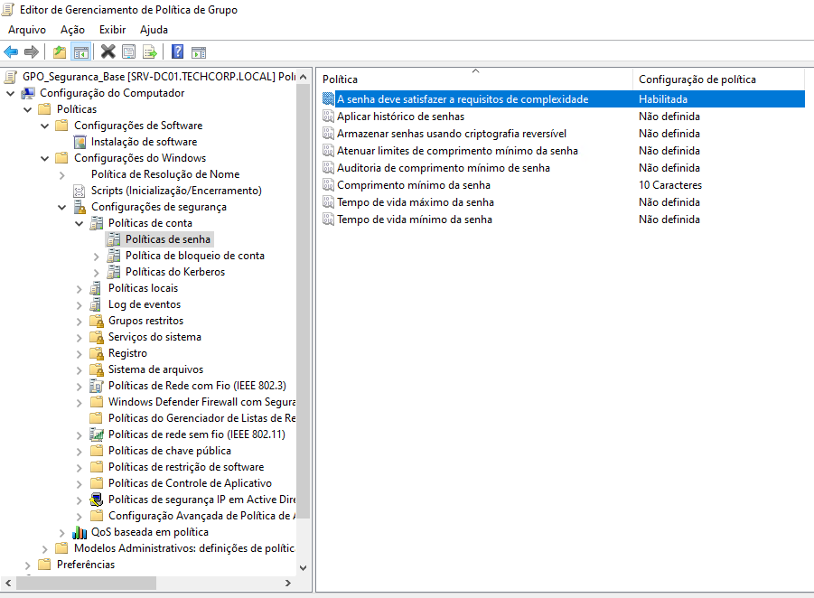

# Implantação de Políticas de Grupo (GPOs)

A administração de políticas foi segregada por finalidade e escopo. O passo a passo de implementação, caminhamento no GPMC e evidências de aplicação estão isolados nos sub-repositórios abaixo:
<--!
| GPO / Política | Escopo | Funcionalidade Principal | Link do Guia |
| :--- | :--- | :--- | :--- |
| **`UGPO_MAP_Rede`** | Usuário | Mapeamento dinâmico de drivers por grupo (ILT) | [Ver Documentação 🔗](#) |
| **`UGPO_SEC_Restricoes`** | Usuário | Bloqueio de CMD, Regedit e painéis administrativos | [Ver Documentação 🔗](#) |
| **`CGPO_SEC_Hardening`** | Computador | Inativação de USBs e bloqueio de tela por inatividade | [Ver Documentação 🔗](#) |
| **`CGPO_SYS_WSUS`** | Computador | Padronização das janelas de atualização do Windows | [Ver Documentação 🔗](#) | -->

## 🔒 Política de Grupo Implementada (`GPO_Seguranca_Base`)
Vinculada diretamente na OU `TechCorp` para afetar todos os usuários e computadores da organização.

* **Requisitos de Complexidade de Senha:** Ativado
* **Tamanho Mínimo de Senha:** 10 Caracteres
* **Histórico e Renovação:** Mantidos em conformidade com o padrão Active Directory

## 🖼️ Evidências de Implantação

### 1. Editor de Gerenciamento de Diretiva de Grupo (GPO de Senha)

### 2. Ingresso do Cliente Windows 10 e Validação de GPO

#🛠️ Detalhamento e Passo a Passo das GPOs

